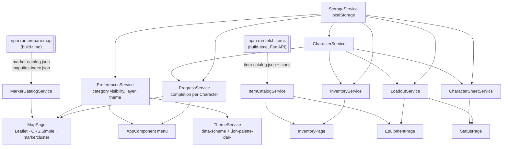

# Elden Ring Tracker

Track your personal progress through *Elden Ring* on an interactive map of the
Lands Between. Pan and zoom the world, switch marker categories on and off, and
mark bosses, sites of grace, dungeons and pickups as done — your progress is
saved on your device.

A browser PWA built with Angular and Ionic — installable, works offline, but
browser-only: there is no native (IOS/Android) project. Unofficial fan project,
made for educational purposes (ÜK 335).

The **Character menu** adds three more screens — Equipment, Inventory and Status —
styled after the in-game menus:

## Status

| Feature | State |
| --- | --- |
| Interactive map — pan / zoom, tiled imagery, Surface + Underground layers | ✅ |
| Real markers — ~740 across 14 categories (313 sites of grace, 155 bosses, dungeons, merchants, collectibles), clustered | ✅ |
| Marker categories with show / hide toggles + progress counts | ✅ |
| Mark markers complete, dimmed when done | ✅ |
| Per-character progress | ✅ |
| Local persistence (progress + preferences) | ✅ |
| Two colour schemes (Erdtree / Ash) + light / dark | ✅ |
| Offline map (service-worker tile cache), installable PWA | ✅ |
| Dungeons · Merchants (found → Bell Bearing) | ✅ 0.2 |
| Collectibles — Golden Seeds, Sacred Tears, Larval Tears, Memory Stones, Talisman Pouches, Crystal Tears, Whetblades, Bell Bearings, Cookbooks, Gloveworts (grouped, hidden by default) | ✅ 0.2 |
| Authentic collectible icons + boss images in the detail popover (`npm run fetch:images`, Fan API) | ✅ 0.2 |
| **Character menu** — Inventory (by-hand mirror), Equipment (full loadout + live status), Status (class + attributes + derived stats), styled like the in-game menus | ✅ |
| **Item Catalog** — ~1,900 items + icons from the Fan API (`npm run fetch:items`) | ✅ |
| **Weapon Attack Rating** — upgrade level, upgrade path and two-handing affect equipped weapon/shield ratings; affinity is tracked but does not yet change the number | ✅ 0.6 |
| **Wondrous Physick** — choose two Crystal Tears, activate the mix, and preview modeled effects | ✅ 0.6 |
| **Flask tracking** — Golden Seed and Sacred Tear completions add the items to Inventory; Status tracks usage, Flask Charges and Flask Potency | ✅ 0.6 |
| DLC (Land of Shadow) layers | ⏳ later |
| Accounts + cross-device sync | ⏳ later |

## Planned, not yet built

- **Crafting & cookbook recipes**, the Inventory *Simple / Detailed* view toggle,
  the Quick-Items pouch, and real Gesture data (the Gestures tab is a name list —
  the Fan API has no gesture icons).
- **Multiple saved builds** per Character (one loadout each for now).
- **Save-file import** — read a real `.sl2` instead of typing quantities.
- **DLC (Land of Shadow)** — map layers *and* *Shadow of the Erdtree* items (the
  Fan API is base-game only).
- **Accounts + cross-device sync**.
- **Route guidance** *(exploratory)* — "what do I do to get X / where do I go
  next" help. Hard to do well; shape TBD.

## How it fits together

## Documentation

- **Release history**: [`CHANGELOG.md`](CHANGELOG.md)
- **Domain vocabulary + working agreements**: [`projekt/CONTEXT.md`](projekt/CONTEXT.md)
- **Design decisions**: [`projekt/docs/adr/`](projekt/docs/adr/)
- **Responsive layout**: [`projekt/docs/responsive.md`](projekt/docs/responsive.md)
- **App-store listing** *(draft)*: [`store/listing.md`](store/listing.md)
- **Project journal**: [`journal/journal.md`](journal/journal.md)
- **Assistant configuration** (not app code): [`projekt/.claude/`](projekt/.claude/)

## Disclaimer

Not affiliated with, endorsed by, or associated with FromSoftware Inc. or Bandai
Namco Entertainment. *Elden Ring*, all map imagery and all related names are the
property of their respective owners. Map imagery and marker icons are adapted
from the community project
[`EthanShoeDev/elden-ring-compass`](https://github.com/EthanShoeDev/elden-ring-compass);
collectible icons, boss images and the whole item catalog are from the
[Elden Ring Fan API](https://eldenring.fanapis.com).
