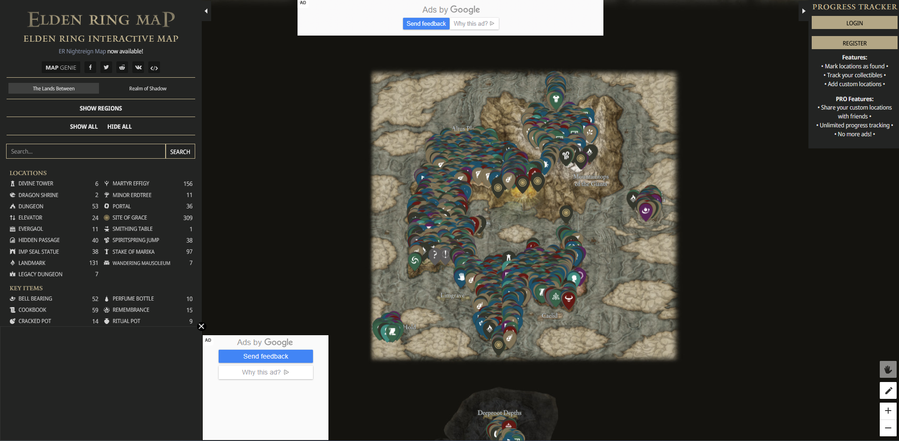
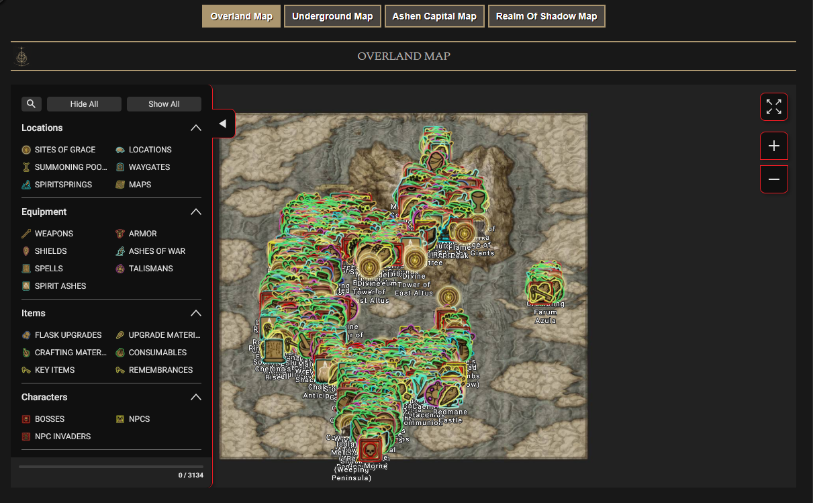
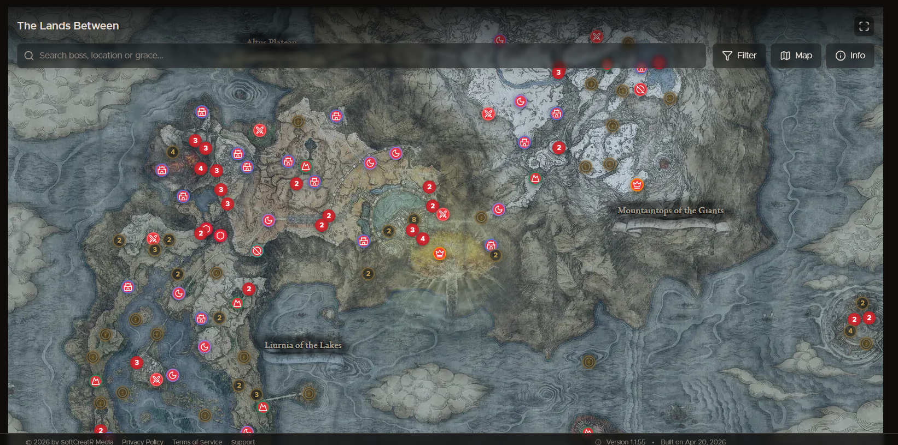
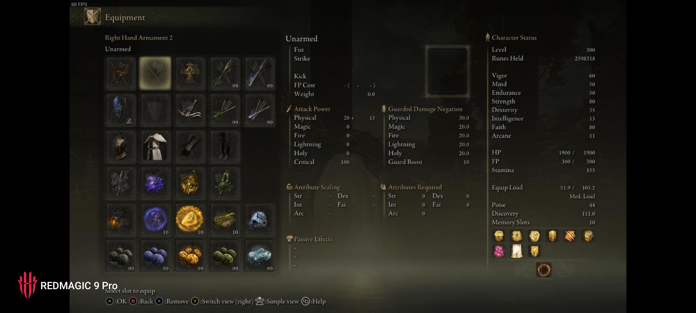
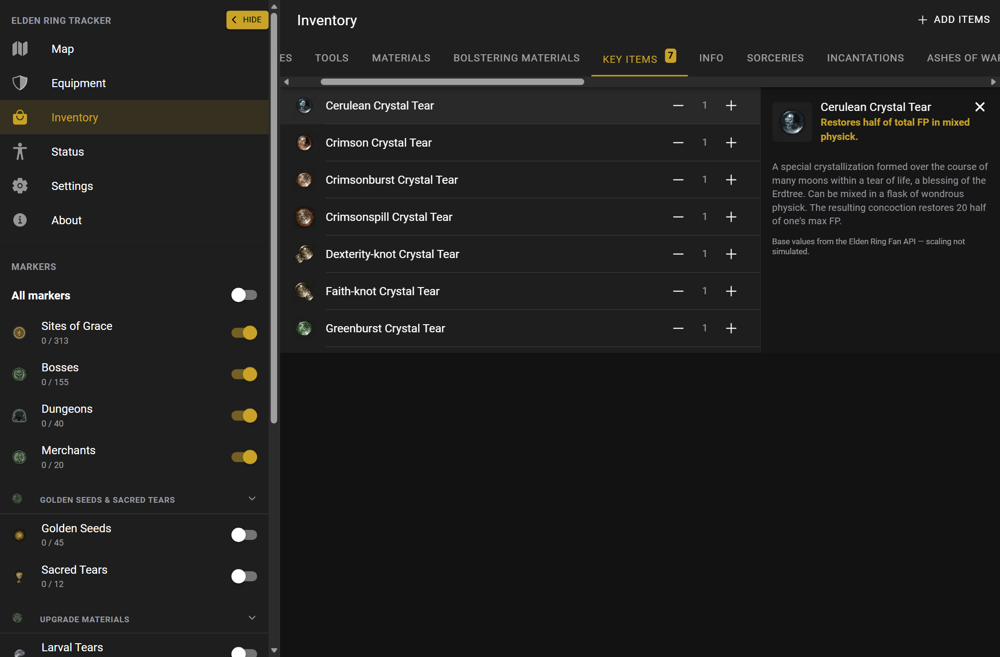

## 3.9., 9:00

- Projekt gestartet. 
- Screenshots vergleichbarer Apps zusammengetragen

Eldenring Map

Interactive Map (wiki)

Elden Ring Tracker

- Setup Ionic Project with sidemenu
Reasoning:
    A sidemenu fits the style of a interactive map more than tabs
- Added PWA

- Added icon

## 3.9., 10:30

| Decision | Reason | 
| :--- | :--- |
| Import Dataset of markers from a community dataset | more amount of data | 
| Marker Completion | To track progress instead of just static markers |
| Map Marker toggle in main Sidesheet | doesn't obscure the map; single sidesheet |
| Tracker per Character | You can have multiple characters in Elden Ring, multiple characters to track |

- Found Assets to be used in the app

| Decision | Reason | 
| :--- | :--- |
| Kartenrendering: Leaflet + CRS.Simple | standard für maps, wenig eigener code |
| 2 Farbschemas (Erdtree & Ash) | Light & Dark mode mit elden ring theme |
|  |  |

## 3.9., 13:00

| Decision | Reason | 
| :--- | :--- |
| Increased supported browser version to support popover | App is made for gamers (expected to have good enough hardware / up to date browsers) |
| Tiling the map into small segments | markers are possible |
| Clustering same type of markers (optional but default) | makes map more overseeable |
| Specific "collected" phrases per marker type | Is more personal to Elden Ring Players |
| Force Service worker to download all images | makes offline usage possible |

- Implemented Interactive Map

## 3.9., 15:00

| Decision | Reason | 
| :--- | :--- |
| Show a blocking splash while downloading images on first run | makes offline usage possible |
|  |  |

- Improved markerGrouping to only make groups of same type
- Created first release

## 4.9., 7:45

- Find groupMarkers error, create patch and deploy

- Adding more markers

| Decision | Reason | 
| :--- | :--- |
| Merchant marker has 2 "complete" states: 1. found 2. bellbearing extracted (killed) | easier to wether a merchant is alive or not |
| dungeon markers are derivated by dungeon graces | makes it possible to show dungeon markers at all, not all dungeons shown though |
|  |  |

Add all of the following markers:
- Merchants
- Dungeon
- Golden Seeds
- Sacred Tears
- Larval Tears (respec), 
- Memory Stones (spell slots), 
- Talisman Pouches, 
- Crystal Tears (physick), 
- Whetblades, 
- Bell Bearings, 
- Cookbooks, 
- Ghost Gloveworts / Grave Gloveworts

Reason: 
- All are items that are important to the game 

- planned new functionalities:
    - Inventory Tracker
    - possibly Guide (tells you what you need to do where to get something)

| Decision | Reason | 
| :--- | :--- |
| Add headers to marker visibility settings and default hidden | more overseeable in settings and on map |
| group markers by group instead of type | collectibles can be grouped -> less markes on the map when not zoomed in |
| Merchant 2 ui completion states: half step to complete when found, full complete when killed | it is not necessary to kill them, but for 100% you need the bell bearings |
| Fetch images from https://eldenring.fanapis.com for markers / detail (dev) | Get's good images easily via an api |
| use sharp for image downscaling (dev) | makes app more performant |
|  |  |

## 4.9., 13:00

- use bell bearing image
- made Marker categories collapsable

| Decision | Reason | 
| :--- | :--- |
| toggle all for markers | easier marker management, toggle looks cleanest |
| no toggle per category | not a priority, would be too bulky |
| make sidepanel toggleable in web aswell | unity across plattforms |
|  |  |
|  |  |
|  |  |

add ipad and sideways look:
- ipad is bigger map vertically while sidepanel width stays almost the same as phone

- Release 0.3.0
- capacitor cleaned up
- add store draft

## 10.9., 8:15

- Planning the Inventory System

| Decision | Reason | 
| :--- | :--- |
| Inventory view instead of collection checklist | You can add all your items from your inventory to track what you currently have |
| Special search for "uncollected" | helps with 100% collectors |
| Inventory per Character | Multiple Characters have multiple inventories |
| Inventory Menu in a faithful style of like in elden ring | easier to manage together with ingame inventory |
| The entire inventory system (items, weapons, armor, stats) | gives full view on character |
| not connected to map (e.g. collecting whetblade != now in inventory) | too complex + new game plus not included |
| unstackable items in game don't have a quantity counter | uniformity with the game |
| items are equipable | makes showing stats dynamically for planning possible |
| stat calculation mocked for now | simpler |
| 3 new pages: equipement, inventory, status | uniformity with the game |
| ability to add items to loadout that are outside of inventory | to plan character builds for the game |
|  |  |

| Decision | Reason |
| :--- | :--- |
| Warm every item icon into the cache on startup (small chip), then serve from cache until the catalog version changes | fast Character screens + offline, same as the map tile warm-up |
| Add-items list paged behind an infinite-scroll (40 at a time) | rendering all 2000 rows at once made the button lag |

- Disabled zoom (except for map)

## 10.9., 13:00

- Adding Character Creation

| Decision | Reason | 
| :--- | :--- |
| Name input validation | FromSoftware also validates the name. 16 Characters max with hard cencorship (knight -> k***ht or kxxxht because of nig) |
| Censorship is included | It brings over the harsh filtering as a joke |
| Startup wizard | friendly start |
| Character creation is miminal | easy start |
| Modal Character Page for managing them | no funky errors by switching page mid creation, etc. |
| Mirror icon on status page to rename character (only way) | Easter Egg to game. Is mentioned in Wizard |
| Force Character if none exist | Makes tracking possible |
| Input Characters name to delete | extra safety |
| Wizard and character creation instead of "saving the lands between" loader | more welcoming, less boring |
| Skip wizard creates default character | simple, can create new character later |
|  |  |

- Add small "the new features" text in wizard
- Existing users see wizard even if they have local data.
- Existing data is migrated into "Tarnished" with Vagabond class (default)

- When all Characters are deleted you are forced to create a new one

## 11.9., 7:45

- Lighthouse done

| | Accessibility | Best Pracices | 
| :--- | :--- | :--- |
| Desktop | 100 | 100 |
| Mobile | 100 | **96** |

NOTE:  

| Decision | Reason | 
| :--- | :--- |
| Leave Best Practices at 96 on Mobile "Serves images with low resolution" | cache size big enough already, zoomed in resolution is good enough |

- Fixed Mobile Sidepanel stuck closed bug
- Fix ui bugs and improve intuitivity / guidance of the app

- Improving Code Quality with fallow

## 11.9., 13:00

- Implementing Weapon Attack Rating and Physik and perma buffs (seeds, tears, etc.)

| Decision | Reason | 
| :--- | :--- |
| "fake" stat calculation | lightweight, full would be out of scope |
| two handing weapon modifies | easy, just 1.5 strength scaling |
| physik effect simulated | lightweight, full would be out of scope |
| map collection of golden seed / sacred tear puts it in inv | automatic collection |
| golden seed / sacred tears can be used (potion buff) | makes tracking potion buffness possible |
| weapon upgrading (smithing stones) with made up boost | upgrade good for tracking, real calculation out of scope |
| Affinities don't change stats | simpler, in scope for 4 days |

- User chooses if weapon uses normal or somber smithing stone scaling
- Collecting golden seed / sacred tears on map, then undo, then again collect, adds the seed / tear to inventory twice. Intentional, rebirth is possible, then map is reset, inventory isn't