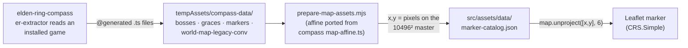

# How marker coordinates are derived

Every Boss and Site of Grace on the map is placed from **Elden Ring's own
in-game coordinates** — nothing is hand-placed or eyeballed. This documents that
derivation, which lives in [`scripts/prepare-map-assets.mjs`](../scripts/prepare-map-assets.mjs).

## TL;DR



- Positions come from `EthanShoeDev/elden-ring-compass`'s generated data
  (MSB world coordinates the game itself uses).
- They are projected to **pixels on the 10496 × 10496 tile-pyramid master** with a
  fixed affine transform (`px = worldX − 7168`, `py = 16640 − worldZ`, 1 px = 1
  world-unit), ported verbatim from that project's `apps/web/src/lib/map-affine.ts`.
- The map component turns those pixels into a Leaflet position with
  `map.unproject([x, y], 6)` on `CRS.Simple` — the same thing compass does.

We did **not** extract anything from the game ourselves. See
[docs/adr/0002](adr/0002-map-assets-from-fan-project.md) for the licensing stance.

## The pieces

### Inputs (`tempAssets/compass-data/*.ts`, committed)

| File | Shape | Has coordinates? |
| --- | --- | --- |
| `bosses.ts` → `BOSSES` | `{ defeatFlagId, name, mapId, x, y, z, runes }` | **yes** — the arena's MSB position |
| `markers.ts` → `MAP_MARKERS` | `{ entityId, mapId, category, displayName, x, y, z, … }` (~24 k rows) | **yes** — every placed entity |
| `graces.ts` → `GRACES` | `{ flagId, name, region, bonfireEntityId, mapArea }` | **no** — only an entity reference |
| `placements.ts` → `PLACEMENTS` | `{ mapId, entityId, x, y, z, lotId, itemId, itemType, quantity, chance, source }` (~14 k rows) | **yes** — every item pickup |
| `goods.ts` → `GOODS` | `{ id, name, category, … }` | — item id → name, for filtering `PLACEMENTS` |
| `world-map-legacy-conv.ts` → `WORLD_MAP_LEGACY_CONV` | `{ srcMapId, master, srcX, srcZ, addX, addZ }` | translation table for legacy areas |

These are `@generated` files from `elden-ring-compass`, produced by *their*
`er-extractor` parsing an installed copy of the game (dvdbnd unpack, FMG / PARAM /
MSB / EMEVD parsing). We copied six of them verbatim.

`x`, `y`, `z` are MSB local coordinates. The game's horizontal plane is **(x, z)**;
`y` is elevation and is **ignored** for map placement.

### The target space

The tile pyramid vendored from compass (`src/assets/map-tiles/`) is a
`{z}/{y}/{x}.webp` grid, 256 px tiles, over a **10496 × 10496 "master" image**,
native zoom 6. A marker's stored `x`, `y` are pixels on that master, origin
top-left. At runtime:

```ts
const NATIVE_ZOOM = 6;                       // from the pyramid manifest
L.marker(map.unproject([marker.x, marker.y], NATIVE_ZOOM))   // CRS.Simple
```

## The projection: MSB world coords → master pixel

Implemented as `markerToMasterPixel(mapId, x, z)`. Two cases.

### 1. Overworld tiles — `m60_CC_RR_LT` (Lands Between; `m61` = DLC)

The master image is a north-up stitch of the game's `MENU_MapTile` grid, and that
grid **is** the `m60` small-tile grid: 256 px == 256 world-units, exactly 1:1.

The map id encodes the tile: `CC` = column, `RR` = row, and the 2-digit suffix
`LT` is `L` = an elevation layer (shares the horizontal grid) and `T` = size tier
(`0` = 256 u small, `1` = 512 u medium, `2` = 1024 u big). Suffixes with tier > 2
are skybox / cutscene LODs and are skipped.

```
size   = 256 * 2^T
worldX = CC * size + size/2 + x      // tile centre is the local origin; +col = east
worldZ = RR * size + size/2 + z      // +row = north
```

Then the absolute map affine:

```
px = worldX + OFFSET_X       OFFSET_X = -7168
py = OFFSET_Y - worldZ       OFFSET_Y = 16640      // Y flips: world +Z (north) → image −y
```

Scale is exactly **1 px = 1 world-unit** — no floating scale factor. `OFFSET_X` /
`OFFSET_Y` are an exact whole number of 256-px tiles and **cannot** be recovered
from the map art alone (the ocean margins are ambiguous), so compass pinned them
from **one ground-truth calibration click**: the Claymore at Castle Morne, world
`(11142.3, 8036.3)` → clicked master pixel `(3978, 8596)`, rounded to the nearest
whole tile. Their `scripts/map-calibrate.ts` validates the result — 154 / 154
graces land on a tile that exists, the N/S/E/W extremes are correct, and it is
isotropic with an independent wiki-coordinate fit.

We copied `OFFSET_X` / `OFFSET_Y` as constants; we did not re-derive them.

### 2. Legacy areas — `m10`–`m18`, `m20`–`m28`

Stormveil, Leyndell, Raya Lucaria, Volcano Manor, the underground rivers, every
catacomb / cave / tunnel — each has its **own** local coordinate frame.
`WorldMapLegacyConvParam` (extracted by compass as `WORLD_MAP_LEGACY_CONV`) maps
each legacy block onto the overworld frame with a **pure translation** (no
rotation, no scale):

```
worldX = x + best.addX
worldZ = z + best.addZ
master = best.master        // M00 surface · M01 underground · M10/M11 DLC
```

then the **same** `px = worldX + OFFSET_X`, `py = OFFSET_Y - worldZ`.

A block can have several base points (large multi-zone dungeons); we pick the
**nearest** one by squared distance in `(srcX, srcZ)`, which approximates a warped
mapping piecewise. Accuracy for these is roughly ±1 tile, versus exact for the
overworld.

### `master` → our layer

`M00 → overworld`, `M01 → underground`. `M10` / `M11` (Land of Shadow) are
dropped — we don't ship those pyramids yet.

## Bosses

`bosses.ts` rows carry the arena position directly. For each **named** boss:

```js
p = markerToMasterPixel(b.mapId, b.x, b.z)
push(`boss-${b.defeatFlagId}`, 'bosses', b.name, p)
```

`id` is `boss-<defeatFlagId>` — the same event-flag bit the save file records, so
completion state could later be read from a save.

## Sites of Grace — the indirection

`graces.ts` rows have **no coordinates**. The position lives on the grace's
*bonfire entity* over in `markers.ts`. So we build an index first, exactly as
compass's `map-pins.ts` does:

```js
// 1. project every placed entity
const entityPixel = new Map();
for (const mk of MAP_MARKERS) {
  const p = markerToMasterPixel(mk.mapId, mk.x, mk.z);
  if (p) entityPixel.set(mk.entityId, p);
}

// 2. look each grace up by its bonfire entity id
for (const g of GRACES) {
  const p = entityPixel.get(g.bonfireEntityId);
  if (p) push(`grace-${g.flagId}`, 'sites-of-grace', g.name, p);
}
```

`id` is `grace-<flagId>` (the discovery event-flag).

## Dungeons

There are no dungeon-entrance coordinates anywhere in the source data. Every minor
dungeon (catacomb / cave / tunnel / hero's grave / shunning-grounds) does have one
interior Site of Grace that carries the dungeon's name, so we place a `dungeons`
marker at that grace's pixel. Graces are taken from `mapArea` 30, 31, 32, 35, 39
and 40; a dungeon split across two graces (`Dragon's Pit` + `Dragon's Pit
Terminus`) is deduped by MSB map block (`m30_01_00`) to the lower `bonfireEntityId`
— the main entrance. Divine Towers (`mapArea` 34) and the DLC (41–43) are excluded;
legacy dungeons (Stormveil, Raya Lucaria) are whole areas and get nothing.

`id` is `dungeon-<flagId>` of the chosen grace. ~40 markers.

## Merchants

`markers.ts` `npc` rows carry an English `displayName`. The wandering merchants are
the ones whose name matches `/Merchant/` (`Nomadic Merchant`, `Hermit Merchant`,
`Isolated Merchant`, …, plus `Merchant Kalé`). Positioned through the same
entity-pixel index as graces. `id` is `merchant-<entityId>`. ~20 markers.

Merchants complete when *found*; the category also declares a `bonusStep` for the
Bell Bearing they drop when killed, recorded separately as `merchant-<entityId>#bell`
and not counted towards progress (see [docs/adr/0003](adr/0003-marker-catalog-schema-v2.md)).

## Collectibles — from `placements.ts`

`placements.ts` is the item-pickup table: one row per placed item, with its `mapId`
+ MSB `x/y/z` (same two projection cases as everything else), an `itemId` into
`goods.ts`, a `source` (`map` / `event` / `enemy`) and a drop `chance`.

For each tracked category we filter `PLACEMENTS` to the matching `goods` entries,
keep only **guaranteed** pickups (`chance === 1`, `itemType === 'goods'`), project,
and collapse rows that land on the same master pixel:

| Category | filter |
| --- | --- |
| `golden-seeds` | `itemId === 10010` |
| `sacred-tears` | `itemId === 10020` |
| `larval-tears`, `memory-stones`, `talisman-pouches` | exact `goods.name` |
| `crystal-tears` | `goods.category === 'Crystal Tear'` |
| `whetblades`, `bell-bearings`, `cookbooks`, `gloveworts` | `goods.name` substring |

`id` is `<category>-<x>-<y>` — position-derived, because `placements.ts` exposes no
stable pickup flag. A marker's `name` is the specific item (`"Nomadic Warrior's
Cookbook [1]"`), so a tooltip still tells you which one. DLC placements (`m61` →
master `M10`) are dropped — there are no DLC tiles to show them on.

## Worked example — Margit, the Fell Omen

`bosses.ts`: `{ defeatFlagId: 10000850, mapId: "m10_00_00_00", x: -16.94, z: -17.6 }`

1. `m10…` is not an `m60`/`m61` tile → legacy path, block `m10_00_00`.
2. `WORLD_MAP_LEGACY_CONV` for `m10_00_00`: `{ master: "M00", addX: 10499, addZ: 9830 }`.
3. `worldX = -16.94 + 10499 = 10482.06`, `worldZ = -17.6 + 9830 = 9812.4`.
4. `px = 10482.06 - 7168 = 3314.06` → **3314**
   `py = 16640 - 9812.4 = 6827.6`  → **6828**

Catalog entry: `{ "id": "boss-10000850", "x": 3314, "y": 6828, "layer": "overworld" }`.
The Margit grace (`grace-71001`, entity `10001951`) resolves to `(3302, 6829)` —
right on top of the fog wall, as it should be.

## Known limitations

- **Elevation is discarded.** Vertically stacked content (a tower boss above a
  courtyard grace) projects to the same pixel.
- **Legacy blocks are piecewise.** Nearest-base-point translation, not a true
  per-point warp, so a marker deep in a large multi-zone dungeon can be off by
  ~a tile.
- **Point-in-time data.** The numbers are whatever `elden-ring-compass` had when
  `tempAssets/compass-data/` was last re-pulled. Re-pull + `npm run prepare:map`
  deliberately to pick up upstream fixes.
- **DLC not placed.** `M10` / `M11` markers are skipped.
- **Dungeons sit on their grace.** No entrance coordinate exists, so a dungeon
  marker overlaps that dungeon's Site of Grace pin.
- **Collectible ids are positional.** `<category>-<x>-<y>`, not an event flag — a
  re-pull that nudges a pickup by a pixel changes its id and orphans any
  Completion tick against it.
