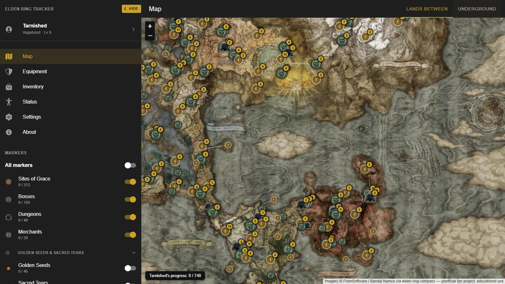
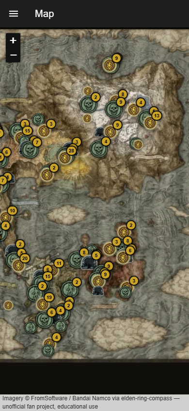
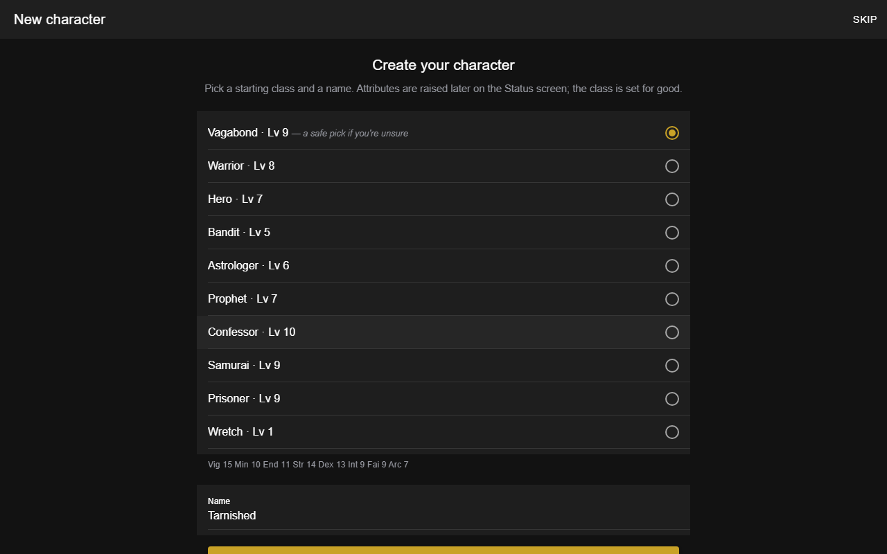
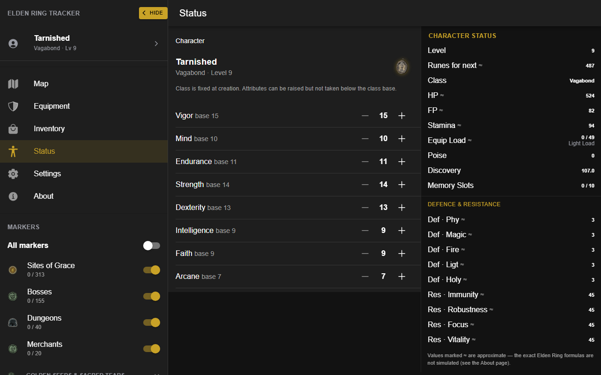
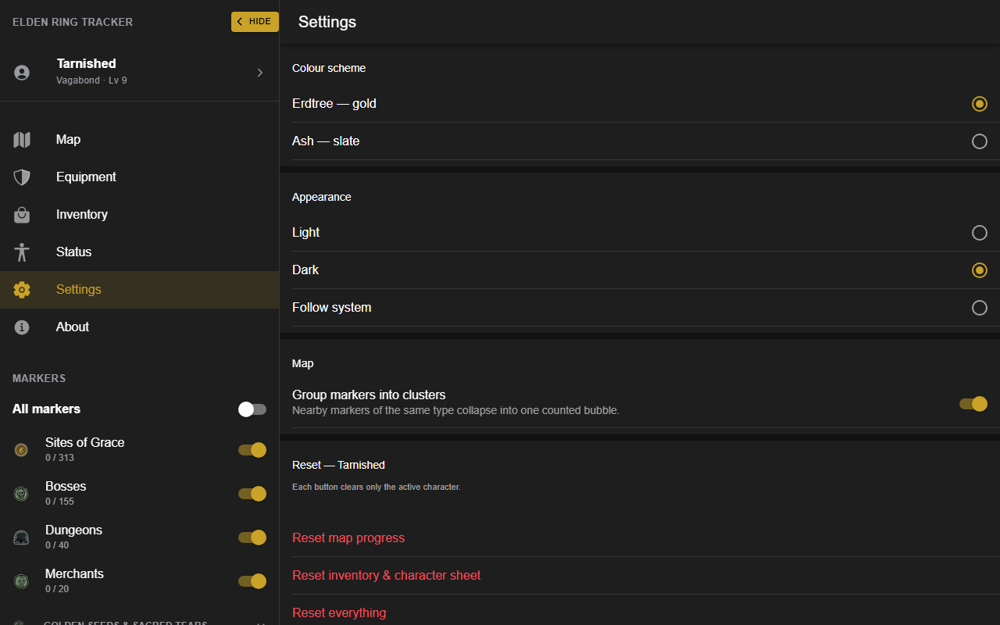
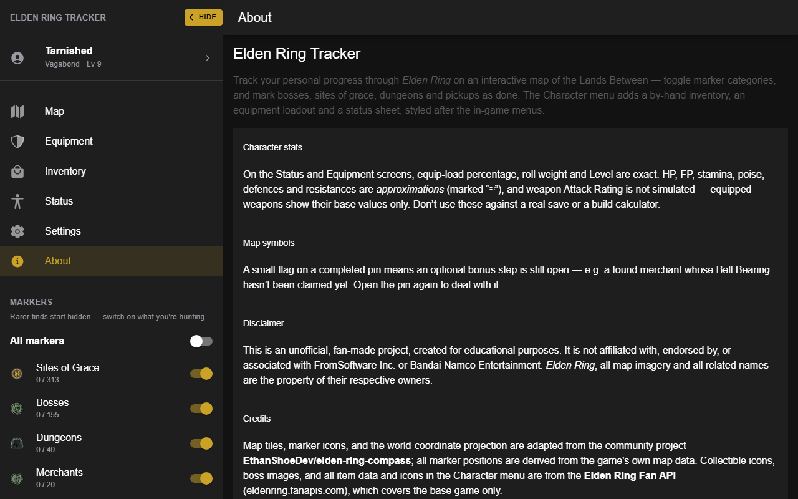
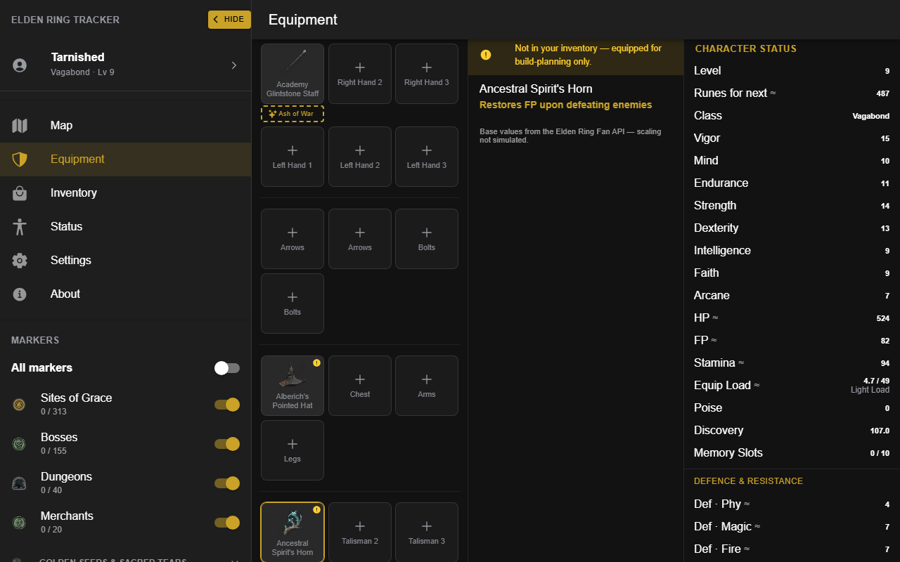
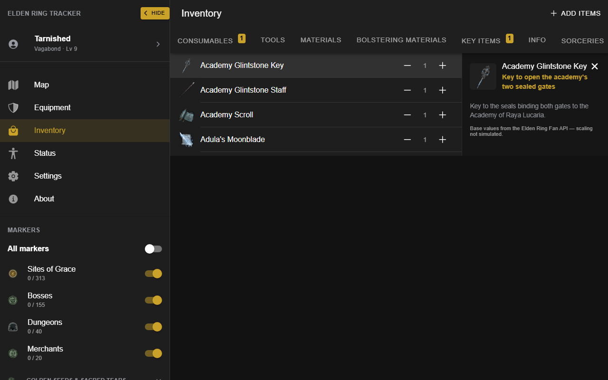

# App-store listing

---

## Name

Elden Ring Tracker

## Subtitle / short description  *(≤ 80 chars)*

Map your Lands Between run — bosses, grace, dungeons, loot. Offline. No account.

## Category

Entertainment  *(secondary: Tools)*

## Full description  *(≤ 4000 chars)*

Elden Ring Tracker is an interactive map of the Lands Between for keeping track of
your own playthrough. Pan and zoom the world, switch marker categories on and off,
and tap a marker to mark it done — bosses defeated, Sites of Grace found, dungeons
cleared, merchants located, collectibles picked up. The menu shows a running
done / total count for every category.

Create a character — name it and choose one of the ten starting classes, which
then stays fixed, just like in the game — and keep as many as you like, switching
between them from the menu. A short first-run intro walks you through it. (You can
rename a character later at the mirror on the Status screen.)

A Character menu, styled after the in-game screens, adds an Inventory you fill in
by hand, an Equipment loadout built from ~1,900 catalogued items, and a Status
sheet — raise your attributes and see the derived stats. Anything you've equipped
that isn't in your inventory is clearly marked. (Equip load and roll weight are
exact; the rest are close estimates, and weapon attack power is not simulated.)

Progress, inventory and build are tracked per character, so a second or third
playthrough starts clean without losing the first. Everything is stored on your
device — no account, no sign-up, no connection required after the first load. On
first run the app downloads the map imagery so it keeps working fully offline.

Two Elden Ring colour schemes (Erdtree and Ash), each with light and dark modes.
Installable as a PWA from your browser.

Unofficial fan project, made for educational purposes. Not affiliated with
FromSoftware or Bandai Namco.

## Feature bullets

- Interactive map of the Lands Between — Surface and Underground layers
- ~740 markers across 14 categories: Sites of Grace, bosses, dungeons, merchants,
  Golden Seeds, Sacred Tears, and more
- Mark markers complete; per-category progress counts
- Create and name characters, each with a locked-in starting class — keep
  several playthroughs and switch between them any time
- Character menu — Inventory, Equipment loadout and Status sheet, in the game's
  own style; ~1,900 items with authentic icons
- Per-character progress, inventory and build, all stored separately
- Works fully offline after first load; installable PWA
- Two colour schemes (Erdtree / Ash) × light / dark / follow-system
- No account, no tracking — progress stays on your device

## Keywords

elden ring, map, tracker, interactive map, bosses, sites of grace, dungeons,
collectibles, completion, checklist, inventory, build planner, loadout, offline,
PWA, souls, fromsoftware

## Screenshots

### Full map, docked menu, desktop 

### Map on a phone, overlay menu 

### Onboarding wizard — class + name 

### Status sheet — identity header, attributes, derived stats 

### Colour schemes + light/dark 

### Credits + disclaimer 

### Equipment screen — loadout + live status 

### Inventory screen with items 

## Disclaimer  *(reused from the About page / README — keep identical)*

This is an unofficial, fan-made project, created for educational purposes. It is
not affiliated with, endorsed by, or associated with FromSoftware Inc. or Bandai
Namco Entertainment. *Elden Ring*, all map imagery and all related names are the
property of their respective owners. Map tiles, marker icons and the
world-coordinate projection are adapted from the community project
`EthanShoeDev/elden-ring-compass`; collectible icons, boss images and all item
data and icons are from the Elden Ring Fan API (eldenring.fanapis.com).
